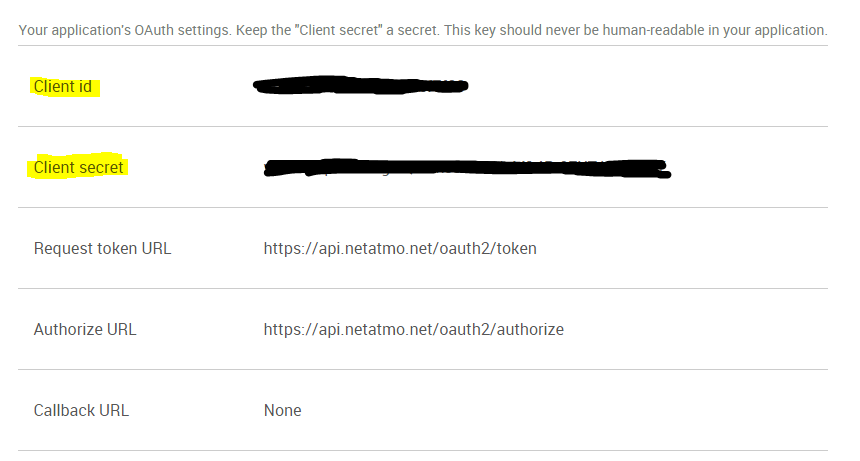

Plugin zur Steuerung von Netatmo-Thermostaten

Plugin Konfiguration 
=======================

Sobald das Plugin installiert ist, müssen Sie Ihre Informationen eingeben
Netatmo-Verbindung :

-   **Kunden-ID** : Ihre Client-ID (siehe Konfigurationsabschnitt)

-   **Geheimer Kunde** : Ihr geheimer Client (siehe Konfigurationsabschnitt)

-   **Benutzername** : Benutzername Ihres Netatmo-Kontos

-   **Passwort** : Passwort für Ihr Netatmo-Konto

-   **Verwenden Sie ein alternatives Design** : erlaubt, einen anderen zu verwenden
    Design (siehe Widget-Abschnitt)

-   **Synchronize** : ermöglicht es Ihnen, Jeedom mit Ihrem Konto zu synchronisieren
    Netamo, um Ihre Netamo-Geräte automatisch zu erkennen. A
    tun, nachdem Sie die vorherigen Einstellungen gespeichert haben.

Verbindungsinformationen abrufen 
==========================================

Um Ihre Station zu integrieren, müssen Sie einen Client\_id und einen haben
client\_secret généré sur le site <http://dev.netatmo.com>.

Klicken Sie einmal auf Start :

Dann auf "App erstellen"

Identifizieren Sie sich mit Ihrer E-Mail-Adresse und Ihrem Passwort

Füllen Sie die Felder "Name" und "Beschreibung" aus (was auch immer Sie wollen
es ist egal) :

Aktivieren Sie dann unten auf der Seite das Kontrollkästchen "Ich akzeptiere die Nutzungsbedingungen"
Klicken Sie dann auf "Erstellen"

Rufen Sie die Informationen "CLient ID" und "Secret Client" ab und kopieren Sie die
im Konfigurationsteil des Plugins in Jeedom (siehe Kapitel
vorherige)

Gerätekonfiguration 
=============================

Die Konfiguration der Netatmo-Ausrüstung ist über das Menü zugänglich
plugin.

> **Spitze**
>
> Platzieren Sie wie an vielen Stellen in Jeedom die Maus ganz links
> ruft ein Schnellzugriffsmenü auf (Sie können
> von deinem Profil immer sichtbar lassen).

Hier finden Sie die gesamte Konfiguration Ihrer Geräte :

-   **Name des Netatmo-Geräts** : Name Ihrer Netatmo-Ausrüstung

-   **Übergeordnetes Objekt** : gibt das übergeordnete Objekt an, zu dem es gehört
    Ausrüstung

-   **Aktivieren** : macht Ihre Ausrüstung aktiv

-   **Sichtbar** : macht es auf dem Dashboard sichtbar

-   **Login** : eindeutige Gerätekennung

-   **Typ** : Art Ihrer Ausrüstung (Station, Innensonde,
    Außensonde…)

Nachfolgend finden Sie die Liste der Bestellungen :

-   Der im Dashboard angezeigte Name

-   Chronik : ermöglicht das Historisieren der Daten

-   erweiterte Konfiguration (kleine gekerbte Räder) : Anzeigen
    die erweiterte Konfiguration des Befehls (Methode
    Geschichte, Widget…)

-   Test : Wird zum Testen des Befehls verwendet

> **Spitze**
>
> Wenn Sie den Widget-Modus ändern, sollten Sie auf klicken
> synchronisieren, um das Ergebnis sofort zu sehen

Faq 
===

Was ist die Bildwiederholfrequenz? ?
Das System ruft alle 15 Minuten Informationen ab.

