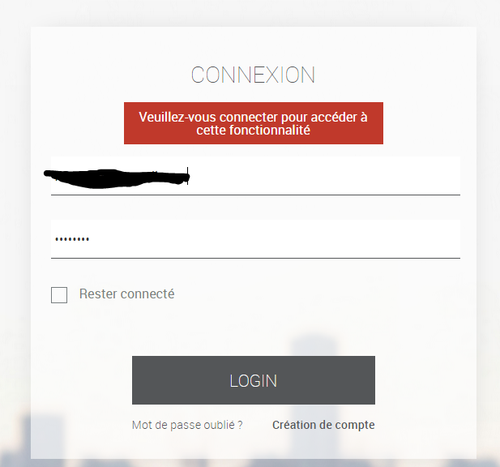
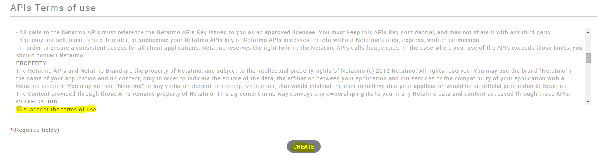

Plugin configuration 
=======================

 :

-   **Client ID** : 

-   **Client secret** : 

-   **Username** : 

-   **Password** : 

-   **** : 
    

-   **Synchronize** : 
    
    .

 
==========================================

:>.

 :

"

 :

"
"

Equipment configuration 
=============================

Plugin.

> **Tip**
>
> As in many places on Jeedom, place the mouse on the far left
> brings up a quick access menu (you can
> from your profile always leave it visible).

Here you find all the configuration of your equipment :

-   **** : 

-   **Parent object** : indicates the parent object to which belongs
    equipment

-   **Activate** : makes your equipment active

-   **Visible** : makes it visible on the dashboard

-   **Login** : 

-   **Type** : ,
    

Below you find the list of orders :

-   the name displayed on the dashboard

-   Historize : allows to historize the data

-   advanced configuration (small notched wheels) : Displays
    the advanced configuration of the command (method
    history, widget…)

-   Test : Used to test the command

> **Tip**
>
> 
> 

FAQ 
===

 ?
.

